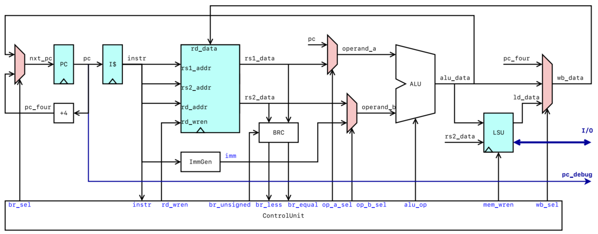

# The Laboratory for Computer Architecture (EE3043)

| Berkeley's Lecture | Milestone2 Tutorial | In This Design |                  Meaning                  |
|:------------------:|:-------------------:|:--------------:|-------------------------------------------|
|        PCSel       |        br_sel       |    pcmux_sel   | Select signal: Source for PC              |
|          -         |        nxt_pc       |     nxt_pc     | Next PC value                             |
|        PC+4        |       pc_four       |     pc_four    | PC+4                                      |
|         PC         |          pc         |       pc       | Program Counter                           |
|          -         |          -          |      pc_en     | Enable signal: Program Counter            |
|        Inst        |        instr        |      inst      | Instruction                               |
|        DataD       |       rd_data       |     rd_data    | Data: Destination Register                |
|        AddrA       |       rs1_addr      |    rs1_addr    | Address: First Source Register            |
|        AddrB       |       rs2_addr      |    rs2_addr    | Address: Second Source Register           |
|        AddrD       |       rd_addr       |     rd_addr    | Address: Destination Register             |
|       RegWEn       |       rd_wren       |   regs_wr_en   | Enable signal: Register File Write Access |
|       R[rs1]       |       rs1_data      |    rs1_data    | Data: First Source Register               |
|       R[rs2]       |       rs2_data      |    rs2_data    | Data: Second Source Register              |
|        BrUn        |     br_unsigned     |   br_unsigned  | Branch Unsigned                           |
|        BrLT        |       br_less       |     br_less    | Check Signal: Less Than                   |
|        BrEq        |       br_equal      |    br_equal    | Check Signal: Equal                       |
|      Imm[31:0]     |         imm         |       imm      | Immediate                                 |
|       ImmSel       |          -          |        -       | Select the immediate value                |
|          -         |      operand_a      |    operand_a   | ALU: First Operand                        |
|          -         |      operand_b      |    operand_b   | ALU: Second Operand                       |
|        Asel        |       op_a_sel      |   alumux1_sel  | Select signal: Source for operand_a       |
|        Bsel        |       op_b_sel      |   alumux2_sel  | Select signal: Source for operand_b       |
|       ALUsel       |        alu_op       |     alu_op     | ALU: Opcode                               |
|         ALU        |       alu_data      |    alu_data    | ALU: Result                               |
|         Mem        |       ld_data       |     ld_data    | Data: Load Instructions                   |
|        MemRW       |       mem_wren      |    lsu_st_en   | Enable Signal: LSU Stored Access          |
|        WBSel       |        wb_sel       |    wbmux_sel   | Select signal: Source for wb_data         |
|          -         |       wb_data       |     wb_data    | Data: Write-back                          |
